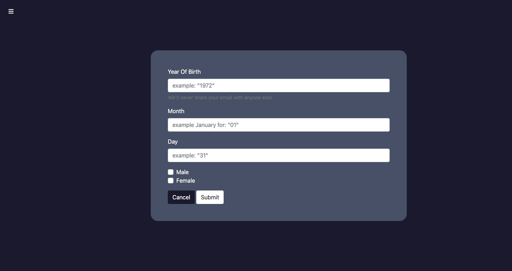
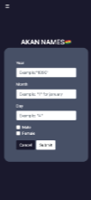

Project Title - Akan-Names-Determiner
=======================================

Description About:

* * *

 Akan-Names-Determiner is a web application that takes a user's birthday and calculates the day of the week they were born and then depending on their gender outputs their "Akan Name" - ghanian Cultural naming System. 

 Akan names are derived from Ghanian culture. Frequently in Ghana, children are given their first name as a 'day name' which corresponds to the day in the week they were born.

### Here are Ghanian day names

### <h4>Male</h4>
* Sunday:Kwasi

* Monday: Kwadwo

* Tuesday: Kwabena

* Wednesday: Kwaku

* Thursday:  Yaw

* Friday: Kofi

* Saturday: Kwame

### <h4>Female</h4>
* Sunday: Akosua

* Monday: Adwoa

* Tuesday: Abenaa

* Wednesday: Akua

* Thursday:  Yaa

* Friday: Afua

* Saturday: Ama


### ≠≠≠ Demo ≠≠≠ 

[Demo](https://moemaair.github.io/Akan-Names-Determiner/) 

### Code Demo


### Formula
dayofTheWeekBorn = (dayBorn + monthCode + yy + Math.floor(yy/4) + centuryCode ) % 7;

Note: the First digit after . in your decimal you would want to check where the Month Code it appers in.


### Technologies Use
 
 * HTML5
 * CSS3
 * BOOTSTRAP
 * GIT
 * JAVASCRIPT 

### Download & Installation
check ⬇ to have a copy of my Project

### Clone over HTTPS

```shell 
$ git clone https://github.com/moemaair/Akan-Names-Determiner.git

```
### Clone over SSH

```shell 
$ git clone git@github.com:moemaair/Akan-Names-Determiner.git

```
### Screenshots



### Authors or Acknowledgments

*   Mohamed Ibrahim
* [Email Me](mailto:rageali12@gmail.com?subject=[GitHub]%20Source%20Han%20Sans)
* 

### License

This project is licensed under the MIT License ©2021